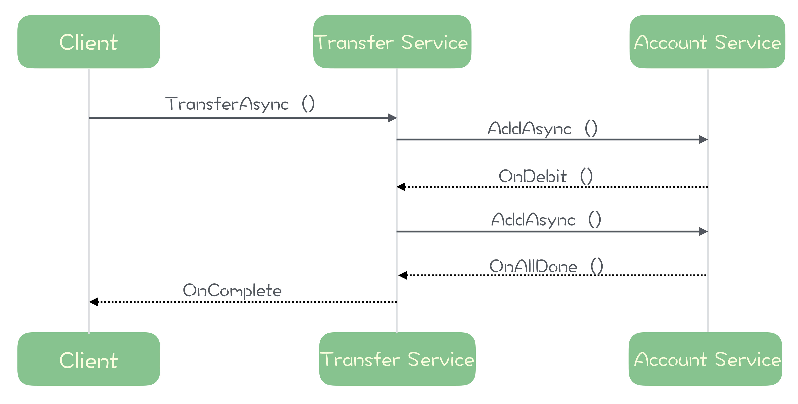
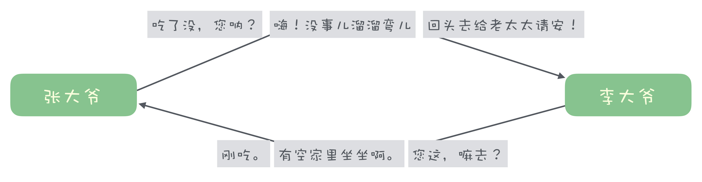
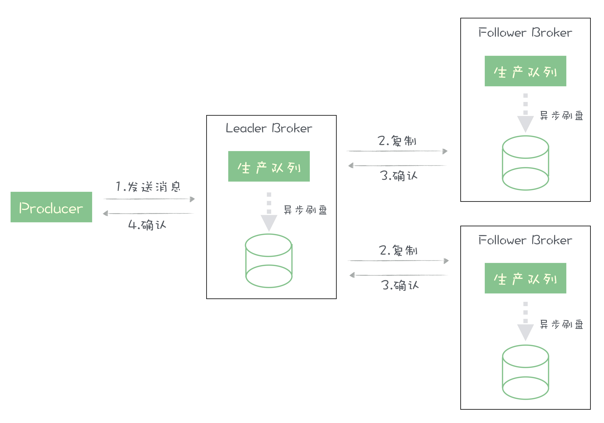
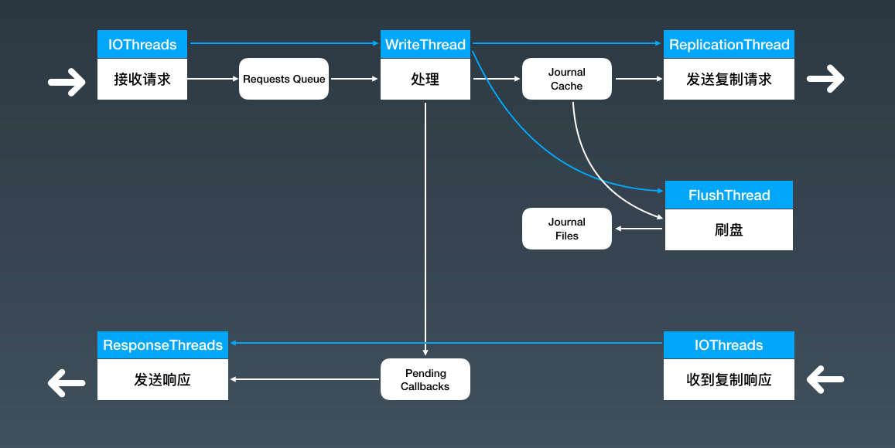

# Message Queue Master

## 基础篇

### Chapter-03 消息模型

- 两种消息模型
  - 队列模型（消息被消费实质就是消息被从队列中移除，所以一份消息被消费一次后就不存在了）。其实可以引入consumer offset的概念，来为每种消费者维护一个偏移量去消费数据，而不是直接移除数据
  - 发布-订阅模型
  - 两种消息模型最大的区别在于**一份消息能不能被多次消费**
  - 
  - 
- 几乎所有的消息队列产品都采用朴素的“请求-确认”（ACK）机制来保证消息不丢失。在生产者端，若生产者没有收到服务端的确认或失败响应，则会重发；在消费者端，若服务端没有收到消费者的消费确认，则会向消费者端重新推送这条消息

------


##### RabbitMQ的消息模型


RabbitMQ使用的是**队列模型**，为了解决队列模型中**一份消息只能被消费一次**的问题，RabbitMQ中引入了Exchange的概念：生产者只负责将消息投递到Exchange，然后再根据Exchange上配置的策略来决定投递到哪些消费者

在RabbitMQ的每个队列（queue）都维护了一份完整的消息数据，有多少组消费者，就有多少个queue。通过这种Exchange-Queue的设计，RabbitMQ解决了“一份消息只能被消费一次”的问题，但是这个问题其实在“发布-订阅”模型中天然满足；一组消费者只能对应一个Queue，其并发性能与RocketMQ相比不足

##### RocketMQ的消息模型


RocketMQ中有了主题（topic）后为什么还有队列（queue）的概念，队列在RocketMQ中发挥了什么作用？

- 在消息队列中为了保证消息的有序性，在一条消息被成功消费之前，下一条消息是不能被同一消费组（consumer group）内的其他消费者实例消费的，否则就会出现空洞，违背了有序性原则

  在同一时刻，每个主题（topic）只能被同一消费组内的一个消费者实例消费，直到这份消息被消费成功之前，同一消费组内的其他实例都只能干看着，因此无法通过水平扩展消费组内的实例数来提升消费端的吞吐量

  RocketMQ中在主题（topic）下引入队列之后，每个主题下的多个队列可以被同一消费组（consumer group）下的多个消费者实例并行消费，主题下的队列相当于分片，将主题中的消息数据分散存储在多个队列中

  RocketMQ中**不保证主题的整体有序，只保证单个队列内的消息有序性**

RocketMQ中，topic中一份消息可以被不同消费组多次消费，所以消息并不会立即删除，这就需要为每个消费组在每个队列上维护一个消费位置（**consumer offset**），这个位置之前的消息都被消费过，这个位置之后的消息都未被消费过，每成功消费一条消息offset就加一。在使用消费队列的时候，**丢消息的原因大多数都是消费位置处理不当导致的**（如去拉消息的时候，请求参数offset越过了未被消费过的消息，导致有部分未消费的消息未被拉取到；或者是）

##### Kafka的消息模型

Kafka的消息模型与RocketMQ的消息模型基本一致，唯一不同点就是Kafka中用“分区（Partition）”的概念替换了RocketMQ中“队列（Queue）”的概念

##### 思考题

RocketMQ中，在消费的时候，为了保证消息不丢失和消息的有序性，每个队列只能串行消费，无法做到并发，否则会出现消费空洞的问题，如果放宽一下限制，不要求严格顺序，能够做到单个队列的并行消费呢？

- 可以做到，RocketMQ中就有此种机制（需要手动配置开启），offset会越过尚未进行消费成功确认（ack）的消息加一；如拉数据/半消息

  这种情况下，消息消费就是个出队操作，而非等待消费端ack后再出队了，这样势必会造成消息的丢失，所以需要有一定的补偿机制，如消息的重传和持久化等


### chapter-04 如何利用事物消息实现分布式事务？

一个严格的事务实现应该具备4个属性：原子性、一致性、隔离型、持久性，即ACID

- 原子性是指一个事务内的所有操作要么全部成功，要么全部失败
- 一致性是指事务提交前后，涉及到的所有数据的总体属性应该保持不变，在预期内，不能出现事务提交前后的数据出现缺失对不上的情况
- 隔离性是指事务与事务之间的操作互不干涉，互不影响，各自独立
- 持久性是指在事务提交之后，后续的操作和故障不会影响到事务提交的结果


事务消息主要适用于那些需要异步更新数据，对数据实时性要求不太高的场景


##### 以电商系统中的下单为例来说明如何利用事务消息实现分布式事务

- 下单总的分为两步：创建订单，清空购物车
- **清空购物车这一步的结果无法影响到创建订单，只以创建订单的结果作为整体事务的结果**
- 具体流程：
  1. 首先订单系统向mq发送一个半消息（半消息此时无法被消费，对订阅者不可见，offset会跳过）
  2. 开启订单系统本地事务
  3. 执行本地事务，创建订单
  4. 根据本地事务执行结果来提交/回滚半消息

- 
- 考虑以上几步每一步可能出现异常的情况
  - 第一步出现异常则整体事务失败
  - 第三步失败则会滚本地事务并进入第四步回滚半消息
  - **第四步提交/回滚半消息失败，这里会有问题，如何解决？**
    - kafka：简单粗暴，直接抛出异常给我们，让用户自行处理，我们可以反复重试或者删除订单补偿
    - RocketMQ：用户提供一个反查接口，RocketMQ会定时去查询反查接口，根据接口结果再对半消息做提交/回滚处理


##### RocketMQ事务消息中的反查机制

在RocketMQ中，为了解决提交/回滚半消息时失败的问题，**增加了事务反查机制**

Producer会实现一个反查接口，如果Producer在提交/回滚半消息时发生网络异常，导致RocketMQ的Broker没有接收到提交/回滚的请求，那么Broker会定时去Producer上去反查这个半消息对应的本地事务的结果，然后根据本地事务的结果再决定提交/回滚半消息

**反查机制的实现并不依赖消息的发送方**，它查询的是数据库数据，也就是说即使发送消息的那台机器当机了，RocketMQ也可以反查其他Producer来获取本地事务的执行结果


##### RocketMQ的事务消息是不是完整的实现了事务的四个特性ACID？

只实现了一致性、持久性以及部分原子性，未实现隔离性

- 未实现隔离性：当本地事务提交成功后，如果用户取消并删除了订单，那么如果出现了需要进行事务反查的情况，那么此时反查接口里查询到此订单不存在，从而回滚半事务消息导致整体事务失败；所以其他的事务会干扰到当前事务

- 部分原子性：当本地事务成功时，事务消息一定成功（即使提交失败也会通过反查来最终提交成功），当本地事务失败时，事务消息一定失败（即使回滚失败也会通过反查来最终回滚成功），而事务消息的提交失败/回滚失败根本不会影响到本地事务，所以在事务消息实现的分布式事务中，只以本地事务的成功/失败结果来作为整体分布式事务的成功失败

  并且当购物车系统的清空购物车本地事务失败时也无法影响到订单系统的本地事务结果


## 进阶篇

### chapter-09 学习开源代码如何入手

- 阅读源码的顺序
  1. 阅读开源项目的灵魂（某篇学术期刊/论文），一般可以从官方文档中找到
  2. 阅读官方文档（Quick Start，Introduction/Basic Concepts，Use case，EcoSystem），了解开源项目的一些关键概念（一般都是开发者自己发明的，e.g. Kafka Partition）及其应用场景
  3. 提出问题（提不出问题怎么办？看官方文档，过程中思考，提出问题）
  4. 带着问题去看官方文档（找一下官方是否有对应的实现文档，DESIGN，IMPLEMENTATION，Improvement Proposal（新功能拓展文档，非核心的更细节功能在此描述）），然后看源码，最后得到答案
     - *不要直接从main方法开始学习源码，源码不是一个线性的存在*
  5. 在带着问题看源码找到答案后，画出核心类图&时序图（or流程图）
  6. 将原理细节用文字描述出来
  7. 点成线
  8. 线成网
  9. 实际应用
  10. 官方文档
  11. 灵魂
- 阅读源码的顺序总的来说是一个整体-细节-整体的过程
- **带着问题去看源码，最好是带着问题的答案去看源码（这就需要先从官方文档找），思考知识点之间的关联，多写总结**

### chapter-10 如何使用异步设计提高系统性能

异步性能虽好，但不能滥用，**只有业务逻辑简单且需要超高吞吐量，或需要长时间等待资源的地方，才使用异步模型**

以转账为例，涉及到三个系统：调用端 -> 转账服务 -> 资金账户服务，两次调用（process1，process2）

- 如果采用同步调用，则整条调用流程都会处于等待中，直到最后一个节点-资金账户服务处理完成，才能终结掉整条处理流程
- 如果采用**<u>异步调用，则每个节点都只需要在接受请求后将业务处理逻辑丢到下面的线程池去处理，然后直接返回就行</u>**，调用节点之间不再存在强依赖（不再等待上游业务逻辑执行完成），提高了整条链路的请求吞吐量。异步调用不仅提高了本节点的请求吞吐量而且因为其请求响应速度的提高，也带动了下游的吞吐量提升
  - 
  - 

在设计异步模型时，有几个点需要注意：

- 每台机器总的线程数量是有上限的
- 并不是线程数越多越好，太多会造成频繁的cpu上下文切换反而拖低了性能，太少会造成cpu时间片工作不饱和。例如：我们有1台电脑，1个程序员，每天工作8小时，我们想提高电脑利用率，使用3个程序员三班倒，这时效率最高，如果直接使用1000个程序员，那么就会产生频繁的工作交接，每个程序员的利用率会变得很低
- 要根据业务逻辑是cpu密集型还是I/O密集型来设置线程池的线程数，cpu密集型一般设置cpu核数线程数，因为耗cpu，不必过多的线程；I/O密集型一般设置2*cpu核数个线程数，提高cpu利用率


异步调用的设计理念

- **<u>异步回调机制的本质就是通过减少线程请求等待时间（空等待，不会占用时间片，所以长时间的等待会造成cpu都处于闲置状态，但新的请求就是进不来（因为线程被打满了））来提高cpu利用率</u>**
  - 如A调用B，B接收请求耗时1s，处理业务逻辑耗时9s，整个过程耗时10s，假设机器的线程数上限是10000，某个时刻有10000个请求过来，若采用同步：那么在后续整整10s内只能一直处理接收的这10000个请求，其qps也就是1000/s；若采用异步回调：我们将请求处理线程池设为9999，业务逻辑处理线程池设为1，那么我们一秒能接收相应9999个请求，qps也就是9999/s
- 具体做法是用少数线程响应业务请求，但处理时这些线程并不真正调用业务逻辑代码，而是简单的把业务处理逻辑扔到另一个专门执行业务逻辑代码的线程后就返回了，故不会有任何等待(CPU时间片浪费)。专门执行业务逻辑的线程可能会由于IO慢导致上下文切换而浪费一些CPU时间片，但这已经不影响业务请求的响应了，而业务逻辑执行完毕后会把回调处理逻辑再扔到专门执行回调业务逻辑的线程中，这时的执行业务逻辑线程的使命已完成，线程返回，然后会去找下一个需要执行的业务逻辑，这里也没有任何等待。回调业务处理线程也是同理
- 以上与《摩登时代》里的卓别林很像，每个人只做自己的那点事(卓别林只拧螺丝)。有的线程只负责响应请求(放螺丝)，有的线程只负责执行业务逻辑(拧螺丝)，有的线程只负责执行回调代码(敲螺丝)，完成后就返回并继续执行下一个相同任务(拧完这个螺丝再找下一个需要拧的螺丝)，没有相互依赖的等待(放螺丝的不等螺丝拧好就直接放下一个螺丝)
- 有利就有弊，分开后是不用等别人了，但想知道之前的步骤是否已经做好了就难了。比如螺丝没有拧紧就开始敲，会导致固定不住。如果发现螺丝没拧好，敲螺丝的人就要和工头说这块板要返工，螺丝取下，重新放，重新拧，之后才能敲
- 个人感觉把关联性强且无需长时间等待的操作(如大量磁盘或网络IO)打包成同步，其他用异步，这样可以在规避CPU时间片浪费的同时兼顾了一致性，降低了补偿的频率和开销


在Java中比较常用的异步框架

- Java8中的[CompletableFuture](https://docs.oracle.com/javase/8/docs/api/java/util/concurrent/CompletableFuture.html)（简单实用）
- ReactiveX中的[RxJava](https://github.com/ReactiveX/RxJava)（功能强大更复杂）


简单的说，**异步思想就是，当我们要执行一项比较耗时的操作时，不去等待操作结束，而是给这个操作一个命令：“当操作完成后，接下来去执行什么”**

使用异步编程模型，虽然并不能加快程序本身的速度，但可以减少或者避免线程等待，**只用很少的线程就可以达到超高的吞吐能力**

异步设计是用来提高cpu利用率的，不能将其理解为节省线程，我们往往将一个完整的请求拆分成接收请求（耗时短）与处理请求（耗时长），就是为了降低单位时间内线程被占用的数量，使接受请求接收线程池被充分使用，不间断的去获取时间片，不使cpu空闲下来，进而提高cpu利用率

同样配置的机器，提高吞吐量，响应时间必然会一定程度上降低，因为资源是有限的，部件的处理能力是有限的，请求变多了，必然导致后面的请求需要排队等待，机器本身的性能是没降低的，只是在外部看来，因为其处理完成的时间变长了，所以看起来是性能降低了


### chapter-11 如何实现高性能的异步网络传输

将整条请求流程拆分开，提高吞吐量，只用少量线程就可以处理大量的连接

NIO使用Selector机制，使用单个线程管理多个连接，解决了多路复用这个异步网络通信的核心问题

NIO Selector实现

- select 轮询 数组
- poll 轮询 链表
- epoll event poll 事件驱动 O(1)

NIO解决了多路复用问题，Netty解决了线程控制、连接管理、缓存管理问题


### chapter-12 序列化与反序列化：如何通过网络传输结构化的数据

- 常见的序列化实现
  - Hessian
  - Protobuf
  - Kryo
  - FST
  - JSON/XML
  - 专用序列化

- 在应用中选择何种序列化实现时应考虑的因素

  1. 序列化好后的数据最好是易于人类阅读的（如JSON序列化）
  2. 序列化后的数据信息密度越大越好，也就是说，同样一个结构化数据，序列化后占用的存储空间越小越好
  3. 实现的复杂度是否够低
  4. 序列化和反序列化的速度越快越好

  不存在一种序列化实现能在这四个方面达到最优，1和2是冲突的，3和4是冲突的，我们需要根据业务场景选择合适的序列化实现

  像 JSON、XML 这些序列化方法，可读性最好，但信息密度也最低。像 Kryo、Hessian 这些通用的二进制序列化实现，适用范围广，使用简单，性能比 JSON、XML 要好一些，但是肯定不如专用的序列化实现

  对于一些强业务系统，如电商系统、社交系统，业务负责，需求变化快，但是对性能需求没有那么苛刻，这种情况下使用JSON序列化实现是不错的选择，无论是调试接口还是排查问题都很方便，付出的代价就是多一点CPU时间和存储空间而已

  

- 实现高性能的序列化与反序列化

  消息中间件这种用于解决通信问题的中间件，对性能要求非常高，通用的序列化实现（JSON/Hessian/Protobuf等）无法满足需求，因此需要实现专用的序列化

  

  对于一个User对象，JSON序列化后的结构如下：

  ```json
  
  {"name":"zhangsan","age":"23","married":"true"}
  ```

  专用序列化，我们通过固定字段顺序，约定对象编号，得到的序列化结构如下：

  ```
  
  03   | 08 7a 68 61 6e 67 73 61 6e | 17 | 01
  User |    z  h  a  n  g  s  a  n  | 23 | true
  ```

  ​	第一部分 用一个字节表示对象类型，我们约定03表示User

  ​	第二部分 姓名 第一个字节表示长度，后面表示内容

  ​	第三、四部分：内容只会有一个字段，因此直接用转化为十六进制即可

  同样的一个 User 对象，JSON 序列化后需要 47 个字节，这里只要 12 个字节就够了


想一下，我们运行的程序中的对象/数据在内存中也是以二进制比特的方式存储，为什么我们不直接使用内存中的对象/数据传输，而要再进行序列化之后再进行传输呢？

- 内存中存储的内容在不同平台、不同语言下的组织可能都不相同，而且内存中存储的内容还包含指针/引用，并不是直接的数据块

### chapter-13 传输协议：应用程序之间对话的语言

- 数据包“断句”的方式

  - 通过在结尾加上特殊字符来标识结尾
  - 约定长度
  - 给定长度（常用） 
    - e.g.  5|hello

- 用双工收发协议来提升吞吐量

  人类之间通过语言进行交流时，基本上就是一种单工通信状态，都是我说你听，然后再你说我听这样，不会有两个人同时说的情况。所谓的单工通信就是，任何一个时刻，数据只能单向传输，一个人说的时候，另外一个人只能听

  HTTP1 协议，就是这样一种单工协议，客户端与服务端建立一个连接后，客户端发送一个请求，直到服务端返回响应或者请求超时，这段时间内，这个连接通道上是不能再发送其他请求的

  TCP连接是一个全双工的通道，可以同时进行数据的收发

  以一段交谈为例，说明从单工到全双工的演进

  1. 单工

     - 

  2. 双工（无序）

     - 

  3. 双工（有序）final

     - 通过为每一段报文加上一个编号，来进行一次会话中请求&响应的匹配

     - 

### chapter-14 如何避免内存溢出和频繁的垃圾回收♻️

GC算法“标记-清除”算法在“标记”和“清除”阶段需要暂停进程，否则计算的结果不准确，这也是为什么在发生垃圾回收的时候程序会卡死的原因；在垃圾回收之后会产生内存碎片，需要进行内存整理，这时候也需要暂停进程

**为什么高并发下程序会卡死？**

​	一般来说，在我们的微服务中，伴随着每一次请求，过程中都会产生一些对象，请求完成之后，这些对象没有用了，将在下一次垃圾回收中被释放掉

- 低并发情况下
  - 在低并发情况下，单位时间内需要处理的请求不多，创建的对象数量不会很多，自动垃圾回收机制可以很好地发挥作用，它可以选择在系统不太忙的时候来执行垃圾回收，每次垃圾回收的对象数量也不多，相应的，程序暂停的时间非常短，短到我们都无法感知到这个暂停。这是一个良性的循环
- 高并发情况下
  - 大量的请求过来会创建大量的对象，这时候会快速充满jvm堆空间，发生GC，在GC的时候进程会**停顿**，大量的请求积压，当GC完成后，大量的请求涌进来，又快速充满了jvm堆空间，再次发生GC，**又进程停顿**，这样一次次进入了一个恶性循环（甚至如果内存回收的速度跟不上对象创建的速度，还有可能导致内存溢出），**导致了我们的程序被卡死**

高并发下的内存管理技巧

- 在请求中尽量少的创建一次性对象，特别是大对象（如请求的内部调用链中，不要重复的创建差不多的新对象，而是将对象往方法下传递）

- 对于需要频繁使用的一次性对象，我们可以通过对象池技术复用对象

- 使用大内存处理器

  最根本的解决方式还是绕开jvm垃圾回收机制，自行实现内存管理，如Flink


如果我们的微服务的需求是处理大量的文本，比如说，每次请求会传入一个 10KB 左右的文本，在高并发的情况下，你会如何来优化这个程序，来尽量避免由于垃圾回收导致的进程卡死问题？

- 使用堆外内存，这样就不会发生频繁gc导致进行频繁停顿
- 使用netty中的池化ByteBuf，复用内存，手动申请&释放内存


### 加餐｜JMQ的Broker是如何异步处理消息的（主要是异步接收消息）

JMQ消息生产的流程：

​	

- 首先，生产者发送一批消息给 Broker 的主节点；

- Broker 收到消息之后，会对消息做一系列的解析、检查等处理；

- 然后，把消息复制给所有的 Broker 从节点，并且需要把消息写入到磁盘中；

- 主节点收到大多数从节点的复制成功确认后，给生产者回响应告知消息发送成功


JMQ消息生产的线程模型：

​	

​	图中白色的细箭头是数据流，蓝色的箭头是控制流，白色的粗箭头代表远程调用。蓝白相间的方框代表的是处理的步骤，我在蓝色方框中标注了这个步骤是在什么线程中执行的。圆角矩形代表的是流程中需要使用的一些关键的数据结构

接收请求是在netty的handler中处理的，只进行基本的检查

为了保证消息的有序性，我们在请求流程的大部分环节只能使用单线程。因为都是内存操作、无锁，所以单线程也能达到很高的性能

发送响应：在刷盘位置或者复制位置更新后，去检查待返回的响应链表 Pending Callbacks，根据 QOS 级别的设置（因为不同 QOS 基本对发送成功的定义不一样，有的设置需要消息写入磁盘才算成功，有的需要复制完成才算成功），**将刷盘位置或者复制位置之前所有响应**，以及已经超时的响应，利用这组线程 ReponseThreads 异步并行的发送给各个客户端

从JMQ接收消息部分的设计中，我们得到了什么？

- 一是我们使用异步设计，把刷盘和复制这两部分比较慢的操作从这个流程中分离出去异步执行；
- 第二是，我们使用了一个写缓存 Journal Cache 将一个写磁盘的操作，转换成了一个写内存的操作，来提升数据写入的性能（减少I/O）；
- 第三是，这个处理的全流程是近乎无锁的设计，避免了线程因为等待锁导致的阻塞；
- 第四是，我们把回复响应这个需要等待资源的操作，也异步放到其他的线程中去执行

总的来说就是：异步、内存操作、无锁、无等待